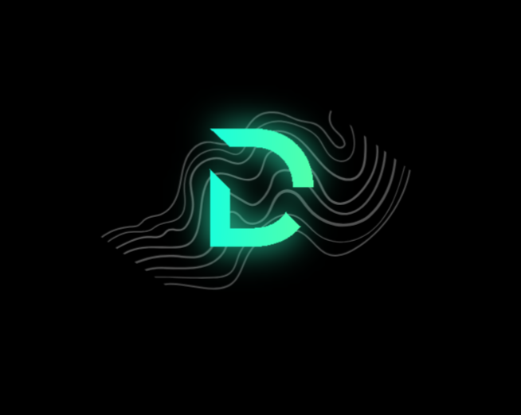

# DEVONIC



**Invent. Develop. Dominate.**

DEVONIC builds lightning-fast websites, powerful mobile apps, and cutting-edge IoT solutions that dominate the digital landscape. We are a professional software development company based in India, helping startups and enterprises turn ambitious ideas into reality.

---

## 📸 Screenshots

Main landing page:


> _Add more screenshots by placing images in the `public/` folder and referencing them here._

---

## 🚀 Features

- ⚡ **Blazing Fast**: Built with Vite, React, and TypeScript for instant feedback and rapid development.
- 🎨 **Modern UI**: Styled with Tailwind CSS and shadcn/ui for a beautiful, responsive interface.
- 🧩 **Modular Components**: Reusable, accessible, and easy-to-customize UI components.
- 🔗 **Supabase Integration**: Scalable backend, authentication, and database out of the box.
- 🌐 **SEO & Social Ready**: Optimized meta tags, Open Graph, and Twitter cards.
- 📱 **Mobile-First**: Fully responsive and touch-friendly.
- 🛠️ **Developer Friendly**: ESLint, Prettier, and modern tooling for a smooth workflow.

---

## 🛠️ Tech Stack

- [React](https://react.dev/)
- [TypeScript](https://www.typescriptlang.org/)
- [Vite](https://vitejs.dev/)
- [Tailwind CSS](https://tailwindcss.com/)
- [shadcn/ui](https://ui.shadcn.com/)
- [Supabase](https://supabase.com/)
- [Radix UI](https://www.radix-ui.com/)
- [ESLint](https://eslint.org/)

---

## 📦 Getting Started

### 1. **Clone the Repository**

```bash
git clone https://github.com/your-username/devonic.git
cd devonic
```

### 2. **Install Dependencies**

```bash
npm install
```

### 3. **Start the Development Server**

```bash
npm run dev
```

Visit [http://localhost:8080](http://localhost:8080) to see DEVONIC in action!

---

## 📝 Project Structure

```
src/
  components/      # UI and layout components
  hooks/           # Custom React hooks
  integrations/    # Supabase and other integrations
  lib/             # Utilities and helpers
  pages/           # Page-level components
  App.tsx          # Main app component
  main.tsx         # Entry point
public/
  logo.png         # Your brand logo
  screenshot.png   # Main UI screenshot
  favicon.ico      # Favicon
```

---

## 🌟 Customization

- **Branding:** Replace `public/logo.png` with your own logo.
- **Colors & Fonts:** Edit `tailwind.config.ts` and `src/index.css` for your brand palette and typography.
- **Meta Tags:** Update `index.html` for SEO and social sharing.

---

## 📄 License

This project is licensed under the [MIT License](LICENSE).

---

## 🤝 Connect

- [Instagram](https://instagram.com/devonic.in)
- [LinkedIn](https://linkedin.com/company/devonic)
- [GitHub](https://github.com/devonic)
- Email: bhagatharshal49@gmail.com

---

> © 2024 DEVONIC. All rights reserved. Built with ⚡ and 💚
